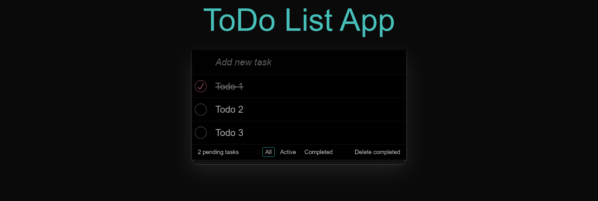

# ToDo List App con Vite, ReactJS y Typescript

Sencilla aplicación de gestión de tareas. Consiste en una única lista de tareas que puedes ir cambiando de estado, borrando o añadiendo nuevas. De igual manera puedes filtrarla por completadas o no. Esta aplicación fue desarrollada como iniciación a Typescript. Es solo una interfaz UI.

## Tecnologías

- Vite
- ReactJS
- Typescript

## Inicialización

1. Descarga el repositorio
2. Instala las dependencias
    `npm install`
3. Ejecuta el proyecto
    `npm run dev`